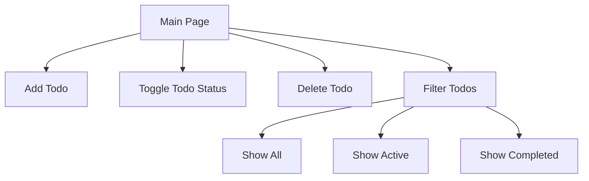
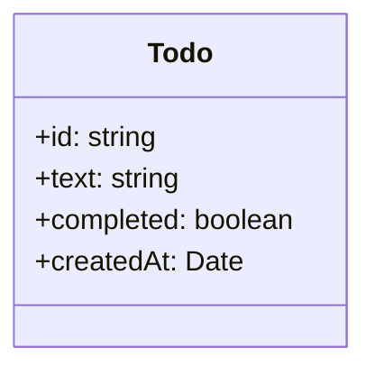

# Simple Todo App Specification

## Overview
A minimalist todo application that allows users to manage their daily tasks efficiently.

## Features
1. Create new todo items
2. Mark todos as complete/incomplete
3. Delete todo items
4. List all todos
5. Filter todos by status (All/Active/Completed)

## User Interface Flow



## Data Structure



## Technical Stack
- Frontend: HTML, CSS, JavaScript
- Backend: Node.js with Express
- Storage: 
  - Frontend: Local Storage (temporary)
  - Backend: JSON file / SQLite
- Build Tool: None (keep it simple)

## API Endpoints

### Tasks API
| Method | Endpoint      | Description                     | Request Body                    | Response                        |
|--------|---------------|--------------------------------|---------------------------------|---------------------------------|
| GET    | /tasks        | Retrieve all tasks             | None                           | Array of task objects           |
| POST   | /task         | Create a new task              | `{ text: string }`             | Created task object             |
| PUT    | /task/:id     | Update a task                  | `{ text?: string, completed?: boolean }` | Updated task object    |
| DELETE | /task/:id     | Delete a task                  | None                           | Success message                 |

### API Response Formats

#### Task Object
```json
{
    "id": "unique-id",
    "text": "Task description",
    "completed": false,
    "createdAt": "2024-03-06T15:00:00.000Z"
}
```

#### Error Response
```json
{
    "error": "Error message",
    "status": 400
}
```

## User Stories

### Must Have
1. As a user, I can add a new todo item
2. As a user, I can mark a todo as complete
3. As a user, I can delete a todo item
4. As a user, I can see all my todos
5. As a user, I can filter my todos by status

### Nice to Have (Future)
1. As a user, I can edit todo text
2. As a user, I can clear all completed todos
3. As a user, I can see how many todos are left

## File Structure
```
mytodolist3/
├── frontend/
│   ├── index.html
│   ├── styles.css
│   └── app.js
└── backend/
    ├── server.js
    ├── routes/
    │   └── tasks.js
    └── data/
        └── tasks.json
```

## Implementation Details

### Local Storage Schema
```json
{
    "todos": [
        {
            "id": "unique-id",
            "text": "Todo item text",
            "completed": false,
            "createdAt": "2024-03-06T15:00:00.000Z"
        }
    ]
}
```

## UI Design
- Clean, minimalist interface
- Responsive design (mobile-first)
- Visual feedback for actions
- Clear status indicators for todo items

## Error Handling
1. Empty todo items not allowed
2. Duplicate todos allowed
3. Graceful handling of localStorage and API errors
4. Max length for todo text (200 characters)
5. API-specific error handling:
   - 400: Bad Request (invalid input)
   - 404: Task not found
   - 500: Server error

## Performance Considerations
1. Efficient DOM updates
2. Minimal re-renders
3. Debounced API calls
4. API response caching
5. Optimized database queries
6. Rate limiting for API endpoints